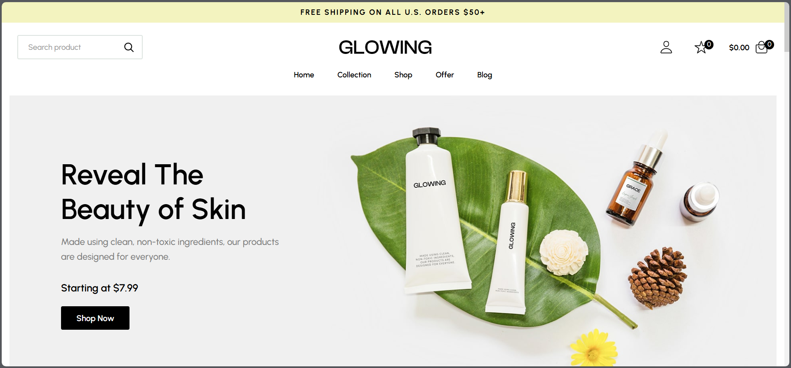
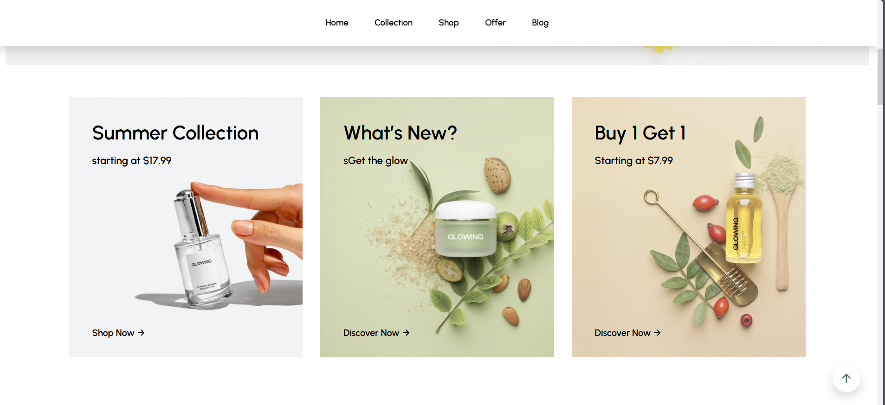
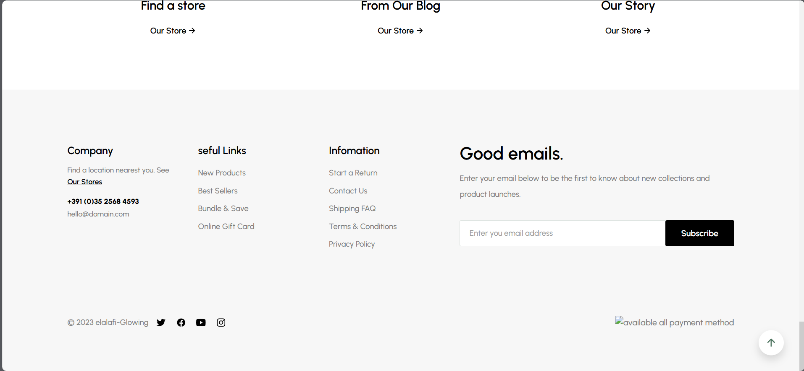

# 🌟 Glowing - Interactive Web UI with Login System


**Glowing** is a beautifully designed front-end web UI template that delivers a dynamic and responsive user experience. Designed with modern web technologies like HTML5, CSS3, and JavaScript, it includes a stylish landing page and a smooth login/register interface.

---

## 🚀 Features

- ✅ Responsive and mobile-first layout
- ✅ Custom-built landing page with animations
- ✅ Tab-based login and register system
- ✅ Clean and modular CSS structure (`assets/css`)
- ✅ Uses Google Fonts & FontAwesome icons
- ✅ Lightweight and fast-loading
- ✅ Developer-friendly folder structure

---

## 📂 Project Structure

```
glowing-master/
│
├── index.html              # Main landing page
├── login.html              # Login & Register interface
├── favicon.svg             # App favicon
├── assets/
│   ├── css/
│   │   ├── project.css     # Styles for index.html
│   │   └── login.css       # Styles for login.html
│   ├── js/                 # (Optional) Add interactivity
│   └── img/                # (Optional) Images used in UI
```

---

## 🎯 Use Cases

This project is ideal for:

- 🚀 Rapid prototyping of web layouts
- 💼 Portfolio and UI showcase
- 🧪 Front-end practice projects
- 🛠️ Base UI for login systems in web apps
- 🎨 Custom branding and theming

---

## 🧰 Technologies Used

- **HTML5**
- **CSS3**
- **JavaScript (Vanilla)**
- **Google Fonts**
- **FontAwesome**

---

## 📸 Screenshots

> You can add screenshots here for better visual representation  
> Example: Login form preview, landing page view, etc.

---

## 🛠️ How to Use

Follow these simple steps to get started with the **Glowing UI project**:

1. **Download or Clone the Project:**
   - Download the ZIP from GitHub or use:
     ```
     git clone https://github.com/your-username/glowing-master.git
     ```

2. **Open the Project:**
   - Use any modern code editor (e.g., **VS Code**, **Sublime Text**)
   - Navigate to the folder containing `index.html` and `login.html`

3. **Launch in Browser:**
   - Double-click `index.html` or `login.html`
   - Or use the `Live Server` extension for auto-reloading during edits

4. **Edit the UI:**
   - Customize styles in `assets/css/project.css` and `login.css`
   - Replace or edit icons, fonts, and animations to match your brand

5. **Extend the Functionality (Optional):**
   - Add JavaScript interactivity (`assets/js/`)
   - Connect to a backend (e.g., Node.js, ASP.NET, Flask) for authentication
   - Add form validation or integrate APIs

6. **Deploy (Optional):**
   - Host the project on GitHub Pages, Netlify, or Vercel

---


## 📸 Screenshots

### 🏠 Home Page


### 🛍️ Product Collection


### 📬 Footer & Contact Info



## 🤝 Contributing

Pull requests are welcome! For major changes, please open an issue first to discuss what you'd like to change.

---
